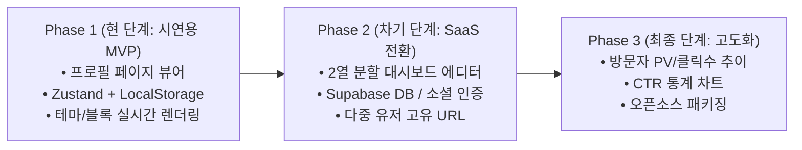

# 📄 [PRD] 링크트리 클론 서비스: 마이링크 (MyLink) 기능 정의서
> **문서 버전**: v1.3 (사용자 시나리오 추가 및 단계별 시연 지향 개정판)  
> **핵심 원칙**: 단계별 구현(Phased Delivery). **현재 1단계는 외부 백엔드·대시보드·통계 없이 '로컬 스토리지'와 '프로필 페이지' 중심으로 시연 가능한 MVP 완성**에 집중합니다.

---

## 1. 프로젝트 개요 (Executive Summary)

### 1.1 서비스 소개
- **서비스명**: 마이링크 (MyLink)
- **개념**: 크리에이터와 개인이 자신만의 링크, SNS, 포트폴리오를 모바일 친화적인 단일 프로필 페이지에서 감각적으로 보여주는 링크인바이오(Link-in-bio) 서비스.
- **개발 및 시연 전략**:
  - **Phase 1 (현재 진행)**: 외부 백엔드 구축이나 복잡한 인증/대시보드 없이, **브라우저 로컬 스토리지(localStorage)와 Zustand**를 활용해 새로고침에도 유지되는 **완성도 높은 프로필 페이지**를 즉시 시연.
  - **Phase 2 (차기 단계)**: 2열 관리자 에디터 및 Supabase(인증, DB, 스토리지) 연동을 통한 멀티테넌트 SaaS 확장.
  - **Phase 3 (최종 단계)**: 방문자 통계(PV, 링크별 클릭수, CTR) 및 애널리틱스 대시보드 구축.

---

## 2. 단계별 마일스톤 (Phased Roadmap)



| 구분 | Phase 1 (현재 시연 단계) | Phase 2 (차기 단계) | Phase 3 (최종 단계) |
| :--- | :--- | :--- | :--- |
| **핵심 목표** | **로컬 스토리지 기반 단독 프로필 페이지 시연** | 관리자 에디터 및 백엔드 연동 | 방문자 유입 성과 분석 |
| **데이터 저장소** | **브라우저 `localStorage` (무설치/즉시 동작)** | Supabase PostgreSQL | Supabase Analytics 로그 |
| **인증 방식** | 인증 없음 (단일 프로필 데모 모드) | 카카오/구글 소셜 OAuth, 이메일 | 권한 기반 RLS 세션 |
| **UI 화면** | **모바일 최적화 공개 프로필 뷰어 & 퀵 컨트롤러** | 2열 분할 에디터 대시보드 | 통계 차트 대시보드 |
| **상태 관리** | **Zustand (`persist` 미들웨어)** | Zustand + Supabase Auto-save | Zustand + Recharts |

---

## 3. 사용자 시나리오 (User Scenarios & User Journey)

본 서비스는 프로필 링크를 열람하는 **방문자(Visitor)**와 자신의 페이지를 소유·편집·시연하는 **소유자(Owner)** 두 주체의 명확한 시나리오를 바탕으로 설계됩니다.

---

### 3.1 👤 방문자 시나리오 (Visitor Scenario)
> **대상**: 인스타그램, 유튜브, 포트폴리오 공유 링크를 타고 들어온 모바일 방문자 (팬, 협업 파트너, 채용 담당자)  
> **목표**: 1초 이내에 크리에이터의 핵심 정보를 파악하고, 원하는 링크로 이동하거나 직접 소통하기

```
[방문자 여정 플로우]
진입 (모바일 최적화) ──> 프로필/SNS 확인 ──> 유튜브 영상 시청 ──> 주요 링크 클릭 ──> 이메일 복사 / 응원(부스트)
```

1. **모바일 최적화 진입**: 스마트폰 브라우저로 마이링크 접속 시 1초 이내에 크리에이터의 아바타, 이름, 직무 뱃지, 한 줄 소개(Bio)가 화면에 로드되어 첫인상을 각인한다.
2. **소셜 채널 탐색**: 상단의 원형 SNS 아이콘 바(인스타그램, 유튜브, 깃허브 등)를 확인하고 원하는 채널로 원클릭 이동한다.
3. **인라인 미디어 감상**: 프로필 내에 임베드된 최신 유튜브 영상 카드를 앱 이탈 없이 프로필 페이지 안에서 직접 재생하여 시청한다.
4. **목적형 링크 탐색**: 섹션 헤더(예: "Portfolio", "Projects")로 깔끔하게 정리된 링크 버튼들을 탐색하고, 썸네일과 서브 설명을 확인한 뒤 관심 있는 링크를 탭하여 외부 웹사이트로 이동한다.
5. **소통 및 인터랙션**:
   - '협업 문의' 버튼을 눌러 이메일 주소를 클립보드에 원클릭 복사하고 토스트 팝업으로 복사 완료를 확인한다.
   - 하단 '응원하기(부스트)' 버튼을 연속으로 눌러 하트 애니메이션과 카운터 숫자가 올라가는 인터랙션을 즐긴다.

---

### 3.2 🛠️ 소유자 시나리오 (Owner Scenario)
> **대상**: 마이링크를 통해 자신만의 퍼스널 브랜딩 허브를 운영하고 시연하는 프로필 소유자 (크리에이터, 개발자, 시연자)

#### 시나리오 O-1. [Phase 1 현 시연 단계] 소유자의 로컬 데이터 커스터마이징 & 시연 여정
- **상황**: 복잡한 서버/로그인 없이 브라우저 로컬 환경에서 프로필을 즉시 커스텀하고 발표/시연하는 상황
```
[소유자 시연 플로우]
초기 시드 데이터 확인 ──> 퀵 테마 스위처로 디자인 변경 ──> 인터랙션 테스트 ──> 새로고침(F5) ──> 데이터 영속성 검증
```
1. **기본 프로필 확인**: 브라우저를 처음 열었을 때 사전 설정된 고품질 시드 데이터(프로필 정보, 링크 리스트, 유튜브 임베드)가 깨짐 없이 완벽하게 렌더링된 상태를 확인한다.
2. **원클릭 테마 전환**: 상단 퀵 테마 스위처 버튼을 클릭하여 'Clean Light', 'Onyx Dark', 'Sunset Gradient' 테마로 전환하며 배경 색상, 버튼 모서리(Pill), 폰트 스타일이 실시간으로 반응하는 모습을 확인/시연한다.
3. **인터랙션 확인**: 직접 부스트(응원) 버튼을 클릭하여 카운터를 올린다.
4. **로컬 스토리지 영속성 검증**: 브라우저를 **새로고침(F5)**하거나 창을 닫았다 다시 열어도, Zustand의 `persist` 미들웨어를 통해 `localStorage`에 저장된 테마와 변경된 부스트 수치가 그대로 유지되는 것을 확인/증명한다.

#### 시나리오 O-2. [Phase 2 & 3 차기 확장] 소유자의 SaaS 링크 허브 관리 & 성과 분석 여정
- **상황**: 정식 SaaS 런칭 후 자신만의 고유 URL을 소유하고 유입 성과를 최적화하는 상황
```
[소유자 SaaS 관리 플로우]
소셜 가입 & URL 선점 ──> 2열 에디터에서 링크 편집 ──> 드래그 앤 드롭 정렬 ──> SNS 프로필 등록 ──> 애널리틱스 분석
```
1. **계정 생성**: 카카오/구글 소셜 로그인으로 10초 만에 가입하고 고유 핸들(`/@username`)을 선점한다.
2. **2열 실시간 편집**: 관리자 에디터의 좌측 패널에서 신규 링크를 추가하고 썸네일을 등록하면, 우측 모바일 라이브 목업에 지연 없이 즉각 반영되는 것을 보며 편집한다.
3. **드래그 앤 드롭 순서 변경**: 노출 우선순위가 높은 링크를 마우스로 끌어서 최상단으로 옮기고 토글을 켠다.
4. **채널 공유**: 발행된 마이링크 URL을 인스타그램 프로필 바이오 및 유튜브 설명란에 부착한다.
5. **성과 분석 및 최적화**: 며칠 뒤 애널리틱스 대시보드에 접속해 일별 방문자 수(PV)와 링크별 클릭률(CTR) 그래프를 확인하고, 클릭률이 저조한 링크는 제목을 수정하거나 배치를 조정하여 전환율을 높인다.

---

## 4. [Phase 1: 현재 시연 단계] 상세 기능 요구사항

현재 시연 중인 프로필 페이지에서 구현할 필수 기능 명세입니다. (대시보드 및 통계는 제외)

### 4.1 로컬 스토리지 기반 전역 상태 관리 (Zustand)
- **STORE-01 (데이터 영속화)**:
  - Zustand의 `persist` 미들웨어를 사용하여 프로필 정보, 링크 목록, 테마 설정값을 브라우저 `localStorage`(`mylink_profile_store`)에 자동 저장.
  - 브라우저를 새로고침하거나 껐다 켜도 사용자가 변경한 링크/테마/프로필 정보가 유실 없이 즉시 복원.
- **STORE-02 (기본 시드 데이터 제공)**:
  - 로컬 스토리지에 저장된 데이터가 없을 경우, 시연에 즉시 활용할 수 있는 풍부한 초기 샘플 데이터(기본 프로필, 5개 이상의 추천 링크, SNS 아이콘, 유튜브 영상 샘플 등)를 자동 로드.

### 4.2 프로필 기본 정보 섹션 (Profile Header)
- **PROF-01 (아바타 & 프로필 소개)**:
  - 원형 프로필 이미지(아바타), 표시 이름(Display Name), 소속/타이틀 뱃지, 한 줄 소개(Bio) 렌더링.
- **PROF-02 (SNS 아이콘 바)**:
  - 인스타그램, 유튜브, 깃허브, X, 이메일 등 주요 소셜 미디어로 바로 연결되는 깔끔한 원형 아이콘 바 배치.
- **PROF-03 (인터랙션 요소)**:
  - 이메일 원클릭 복사(클립보드 토스트 알림), '응원하기(부스트)' 버튼 등 시연 시 시각적 반응을 극대화하는 마이크로 인터랙션 포함.

### 4.3 콘텐츠 및 링크 블록 렌더러 (Content Blocks)
- **BLOCK-01 (일반 링크 버튼)**:
  - 제목, 부가 설명 문구, 좌측 썸네일/파비콘 아이콘, 클릭 시 새 탭 이동.
  - 마우스 호버 및 클릭 시 매끄러운 트랜지션 애니메이션.
- **BLOCK-02 (섹션 구분 헤더)**:
  - 링크 카테고리를 분리할 수 있는 텍스트 헤더 및 구분선 블록.
- **BLOCK-03 (미디어 임베드 - 유튜브)**:
  - 데모 영상 URL 입력 시 프로필 화면 내에서 직접 재생되는 반응형 반응형 유튜브 플레이어 카드.

### 4.4 실시간 테마 & 스타일 전환 (Theme Switcher for Demo)
- **THEME-01 (원클릭 테마 전환)**:
  - 시연 중 즉석에서 디자인을 바꿀 수 있는 퀵 테마 스위처 제공:
    - **Clean Light (모던 라이트)**: 깔끔한 화이트 캔버스 + 정제된 블루 악센트
    - **Onyx Dark (다크 모드)**: 깊이감 있는 블랙/차콜 배경 + 미니멀 보더
    - **Sunset Gradient (그라디언트)**: 트렌디한 감성 그라디언트 배경
- **THEME-02 (버튼 스타일 반영)**:
  - 테마에 따라 버튼 모서리 둥글기(Pill / Rounded), 배경 채우기(Solid / Glassmorphism), 텍스트 폰트 실시간 반응.

---

## 5. [Phase 2 & 3: 차기 확장 로드맵] 요약

> ⚠️ **주의**: 현재 시연 단계에서는 구현하지 않으며, 향후 고도화 단계에서 구현할 백로그입니다.

### 5.1 Phase 2 (SaaS 전환 및 관리자 대시보드)
1. **관리자 2열 에디터 (`/admin`)**:
   - 좌측 편집 폼(링크 추가/수정/삭제, 드래그 앤 드롭 순서 변경) + 우측 실시간 모바일 목업 프리뷰.
2. **Supabase 백엔드 연동**:
   - 카카오/구글 소셜 OAuth 및 이메일 로그인 (`/login`, `/signup`).
   - PostgreSQL DB 및 Row Level Security(RLS) 적용.
   - Supabase Storage를 통한 프로필/배경 이미지 파일 업로드.
3. **고유 유저 URL (`/@username`)**:
   - 다이내믹 라우팅으로 사용자별 독립 프로필 페이지 제공.

### 5.2 Phase 3 (방문자 통계 및 애널리틱스)
1. **PV 및 링크 클릭 로깅**:
   - 프로필 방문 수 및 개별 링크 클릭 이벤트 비동기 트래킹.
2. **통계 차트 대시보드 (`/admin/analytics`)**:
   - Recharts 기반 최근 7일/30일 일별 추이 꺾은선/막대 차트.
   - 링크별 클릭률(CTR) 랭킹 및 전환 지표 시각화.

---

## 6. 현재 단계 기술 스택 (Phase 1 Focused)

```
[ 브라우저 클라이언트 ]
  ├── Next.js 16 (App Router, React 19, TypeScript)
  ├── Tailwind CSS v4 (반응형 모바일 UI, 테마 토글)
  ├── Lucide React (소셜 미디어 및 링크 아이콘)
  └── Zustand (create & persist 미들웨어)
           │
           ▼
[ 브라우저 로컬 스토리지 (localStorage) ]
  └── 키: 'mylink_profile_store' (프로필, 링크 목록, 현재 테마 보관)
```

---

## 7. Phase 1 구현 체크리스트 (시연 준비 태스크)

- [ ] **Zustand LocalStorage 스토어 구현 (`useProfileStore`)**:
  - 기본 시드 데이터(프로필 정보, 링크 리스트, SNS 링크) 정의
  - `persist` 미들웨어 연동으로 로컬 스토리지 동기화
- [ ] **모바일 반응형 프로필 레이아웃 구축**:
  - 스마트폰 화면 최적화 너비(`max-w-md`) 중앙 정렬
  - 프로필 아바타, 이름, 바이오, SNS 아이콘 바 렌더링
- [ ] **콘텐츠 블록 컴포넌트 개발**:
  - 일반 링크 카드 (썸네일, 타이틀, 설명, 호버 액션)
  - 섹션 구분 헤더
  - 유튜브 영상 임베드 플레이어
- [ ] **시연용 퀵 테마 스위처 추가**:
  - 상단/플로팅 컨트롤러로 라이트/다크/그라디언트 테마 원클릭 변경 시연
- [ ] **마이크로 인터랙션 구현**:
  - 이메일 복사 토스트 팝업
  - 부스트(응원하기) 카운터 증가 애니메이션
